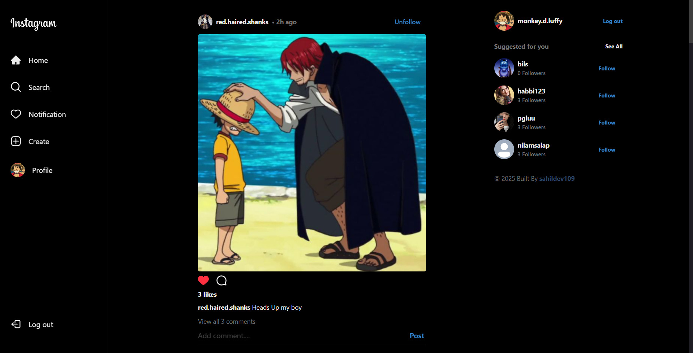
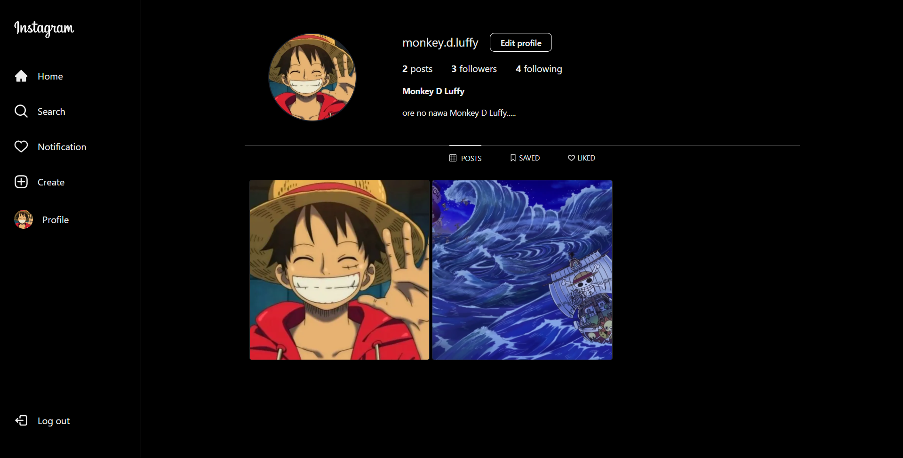
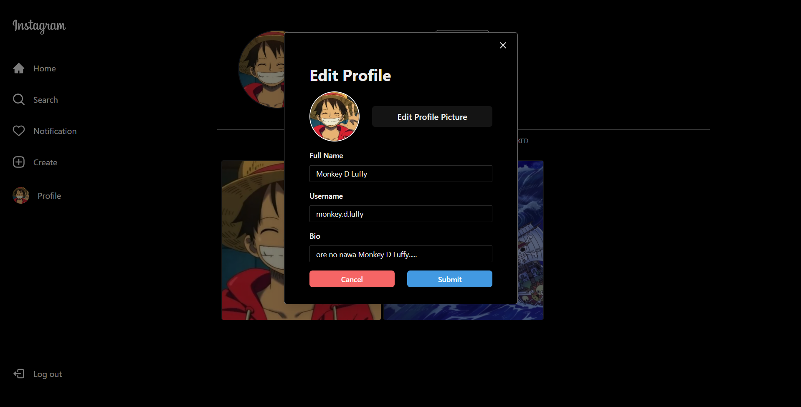
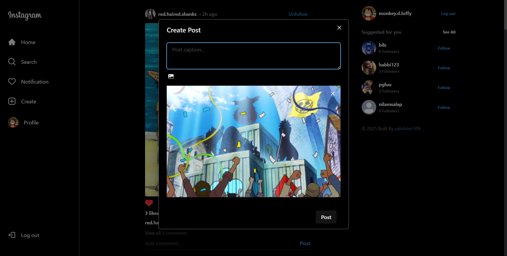
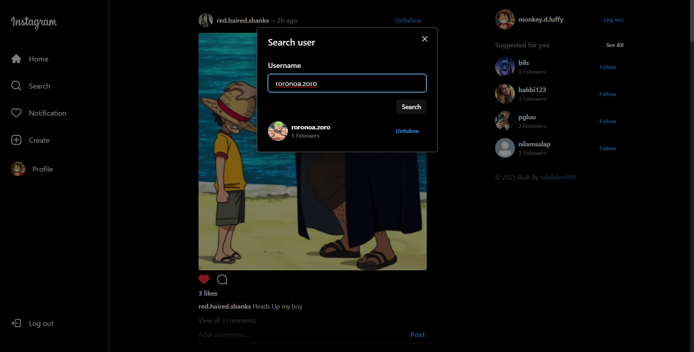

# InstaHub - An Instagram Clone

An Instagram clone built with **React**, **Firebase**, **Zustand**, and **Cloudinary**.

## Live Hosted Link
[InstaHub](https://insta-hub-a-instagram-clone.vercel.app)

---

## Features
- **User Authentication** (email, Google)
- **Responsive Design**
- **User Profile Management**
- **Create, edit, and delete posts**
- **Search users**
- **Interactive posts** (like, unlike, comment)
- **Follow/Unfollow users**
- **Suggested users section**

---

## Screenshots
### Login Page

### Home Page

### Profile Page

### Edit Profile Page

### Create Post Page

### Search Page

### Post Page

---

## Technologies Used
- **React.js**: Frontend framework
- **Firebase Authentication**: Secure login
- **Zustand**: State management
- **Firebase Firestore**: Database for storing user and post data
- **Cloudinary**: For database and image storage
- **Vercel**: For deployment

---
